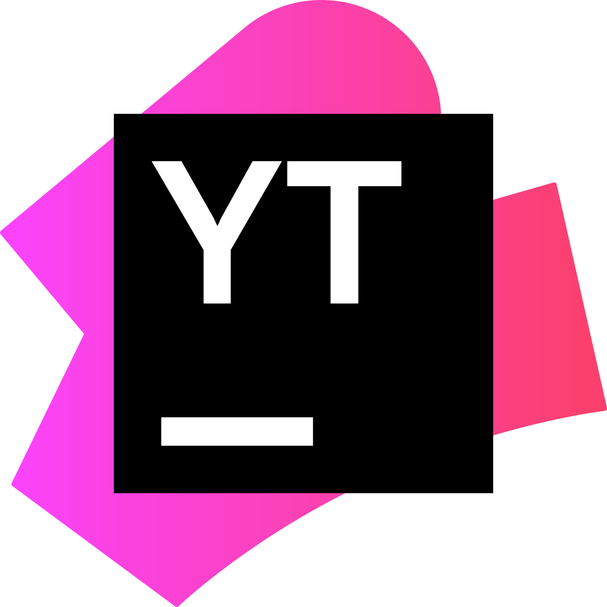
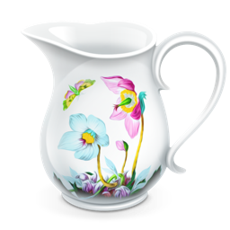

<h1 align="center"> 👋 Привет, я Евгения </h1>

QA Engineer (Automation, Java)

### Обо мне:

* QA Engineer специализирующийся на ручном UI и API тестировании. Более 3 лет опыта.
* В настоящее время развиваю навыки автоматизации.
- - -
### Технологический стек:

  

 
 

 
 
 

### Контакты:
* Telegram: [@ev_kaz](https://t.me/ev_kaz) 